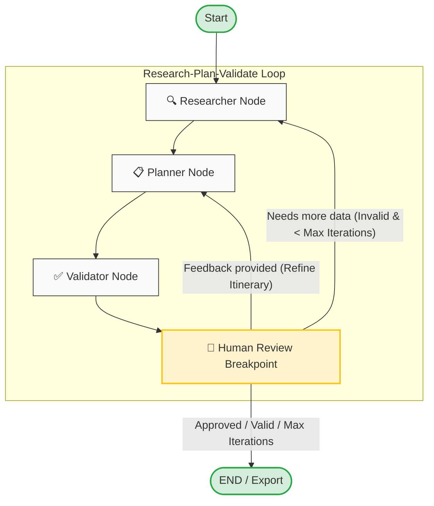
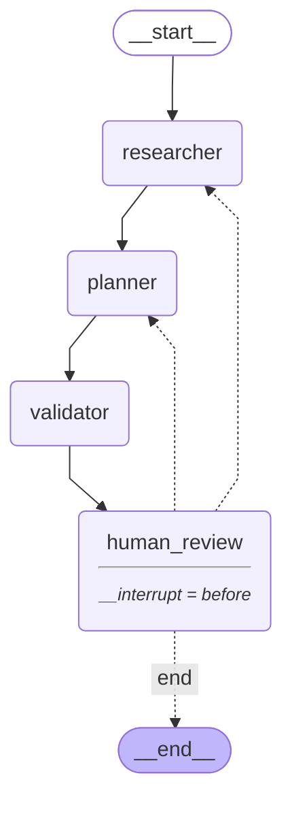

# ✈️ AI Travel Planner (HITL Edition)

An advanced AI-powered travel planner that features a **Human-in-the-loop (HITL)** workflow. It orchestrates a collaborative research-plan-validate loop using **LangGraph** and **Persistence** to create refined, budget-conscious travel itineraries.

## 🚀 Overview

This project utilizes a **Multi-Agent Orchestration** workflow where the AI and the user collaborate:
- **🔍 Researcher**: Dynamically generates search queries and fetches real-time data for flights, hotels, and activities using the **Tavily API**.
- **📋 Planner**: Processes raw data into a structured itinerary using **Llama 3.3 (via Groq)**. It supports both initial generation and surgical refinement based on user feedback.
- **✅ Validator**: Cross-checks the generated plan against the user's budget and requirements.
- **👤 Human Review**: **(New)** A dedicated breakpoint where the graph pauses, allowing the user to review the draft and provide feedback or approve the final plan.

## 🔄 LangGraph Workflow

The planning state machine is built as a stateful graph using **LangGraph**. Below is the conceptual workflow, followed by the actual compiled graph structure.

### 1. Conceptual Workflow

The workflow orchestrates the loop of researching, planning, validating, and requesting human input:



### 2. Compiled Graph Structure

This is the exact compiled representation of the graph, showing the entry points, breakpoints, and edge transitions as generated by LangGraph:



### Workflow Nodes & Edge Logic

1. **`researcher` (Entry Point)**: Generates Tavily search queries for flights, hotels, and activities based on the trip parameters and retrieves real-time pricing and information.
2. **`planner`**: Parses the retrieved research data (or existing draft context + user feedback) and generates a structured itinerary using Llama 3.3 on Groq.
3. **`validator`**: Cross-checks the plan details (calculating total cost, verifying flight/hotel completeness, and checking against the user's budget limit).
4. **`human_review` (Breakpoint)**: Pauses graph execution and saves state. The Streamlit UI displays the current draft and prompts the user for feedback or approval.
5. **Conditional Edge (`should_continue`)**:
   - If the user provides feedback (e.g., requests to change hotels or add activities), the graph loops back to the **`planner`** node to surgically update the itinerary.
   - If the plan is invalid and iteration count is under the maximum limit, the graph loops back to **`researcher`** to search for better alternatives.
   - If the user approves, the plan becomes valid, or maximum iterations are reached, the graph proceeds to **`END`** and is ready for export.

## ✨ Key Features

- **Human-in-the-loop (HITL)**: Take control of the planning process. Review drafts and request specific changes (e.g., "Add more museums," "Find a cheaper hotel").
- **Full State Persistence**: Powered by LangGraph's `MemorySaver`, the agent remembers your trip details, search results, and previous versions of the plan across interactions.
- **Surgical Refinement**: The agent intelligently edits existing drafts instead of starting from scratch, ensuring stable parts of your plan (like a selected hotel) stay unchanged unless requested.
- **Sticky State Architecture**: Custom reducers ensure core configuration like budget and currency are never lost during the feedback loop.
- **Dynamic Trip Selection**: Choose between **Round Trip** and **One Way** journeys with smart duration calculation.
- **Currency Support**: Plan your trip in **INR** or **USD**.
- **Version Control & Draft History**: View previous versions of your itinerary side-by-side with the current draft. Instantly roll back or restore any older version from the persistent checkpointer history.
- **Rich UI**: Interactive **Streamlit** dashboard with a tabbed interface for easy browsing of flights, hotels, and daily schedules.
- **📅 Export to Calendar & PDF**: Instantly export your final itinerary as a standard `.ics` file for calendar integration (Google Calendar, iCal, Outlook) or download a premium, print-ready PDF containing detailed itineraries, metadata summary cards, and dynamic page numbering.

## 📁 Project Structure

```text
travel_planner/v1/
├── app.py           # Streamlit Web Interface (with Cached Persistence)
├── graph.py         # LangGraph state machine & Collaborative logic
├── state.py         # Agent state schema with Sticky Reducers
├── models.py        # Pydantic data models (Itinerary, Flight, etc.)
├── export.py        # PDF & iCalendar Export Engine
├── tools.py         # Search tool integration (Tavily)
├── main.py          # Legacy CLI entry point
├── .env             # API Key configuration
└── requirements.txt # Project dependencies
```

## 🛠️ Setup & Installation

1. **Environment Variables**:
   Create a `.env` file in the root directory:
   ```env
   GROQ_API_KEY=your_groq_api_key
   TAVILY_API_KEY=your_tavily_api_key
   ```

2. **Install Dependencies**:
   ```bash
   pip install -r requirements.txt
   ```

## 🖥️ Usage

### 🌐 Web Interface (Recommended)
Launch the collaborative dashboard:
```bash
streamlit run app.py
```
*Tip: Use the "Start New Planning" button in the sidebar to initialize a fresh session.*

## 🧠 Technical Highlights

- **LangGraph Checkpoints**: Uses `MemorySaver` to provide a persistent memory for the agent.
- **Streamlit Caching**: Utilizes `@st.cache_resource` to keep the LangGraph checkpointer alive across UI refreshes.
- **Llama 3.3 (Groq)**: High-speed, high-quality reasoning for structured itinerary generation.
- **Pydantic**: Ensures strict data integrity for all output models.
- **Surgical Prompting**: Context-aware prompts that allow the LLM to differentiate between "Generating" and "Refining" modes.
